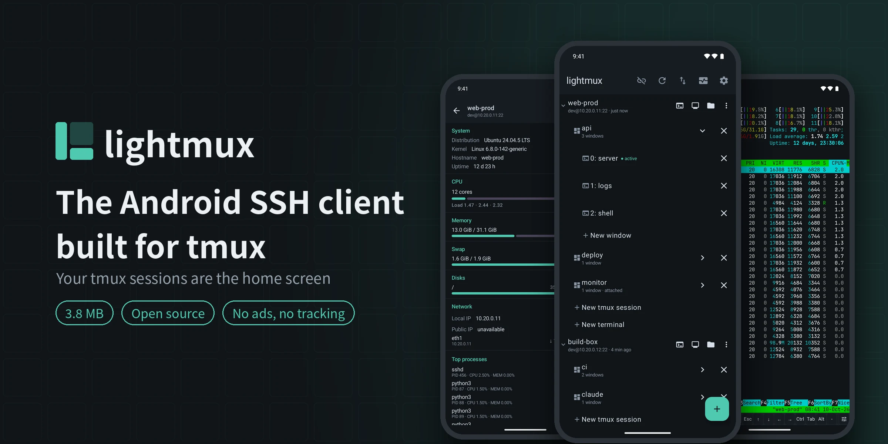
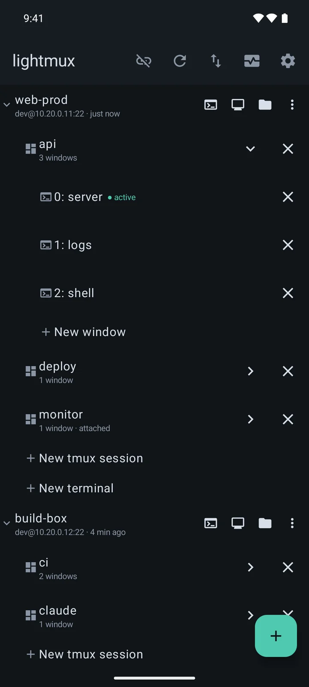
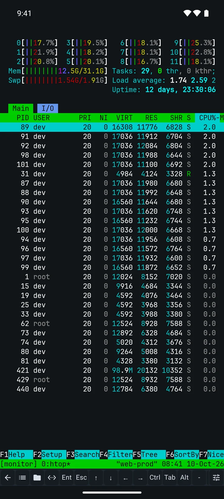
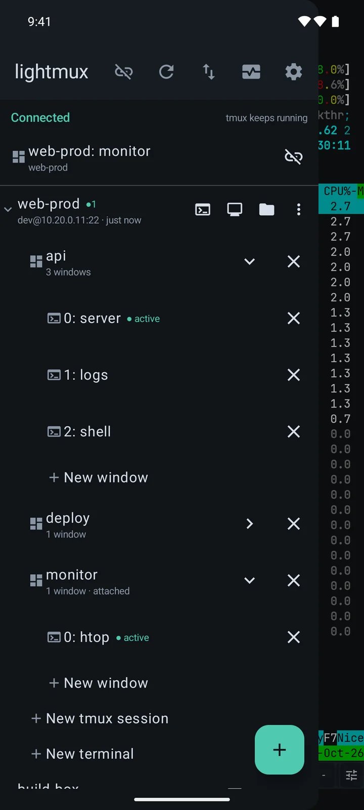
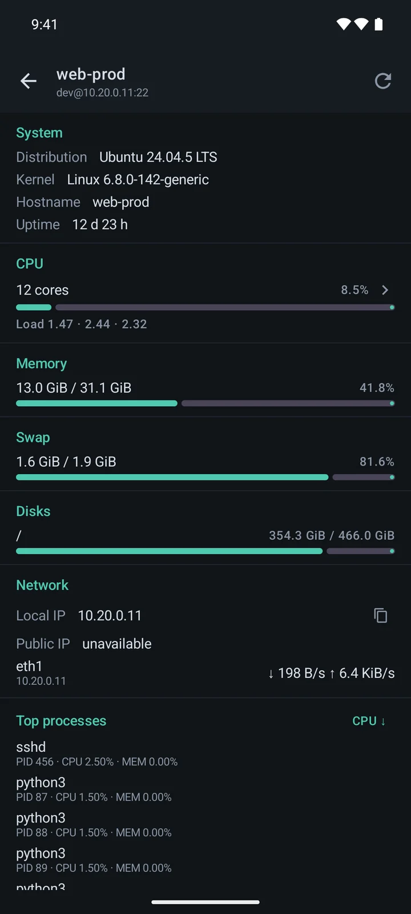
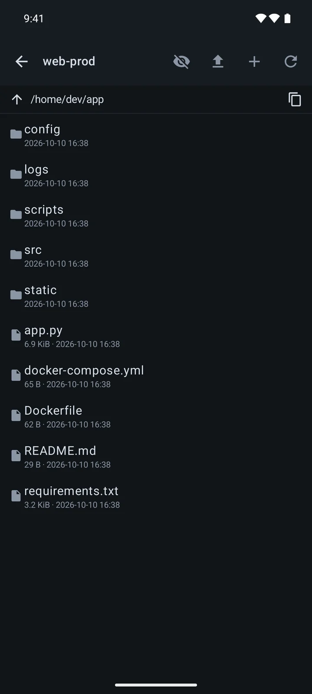
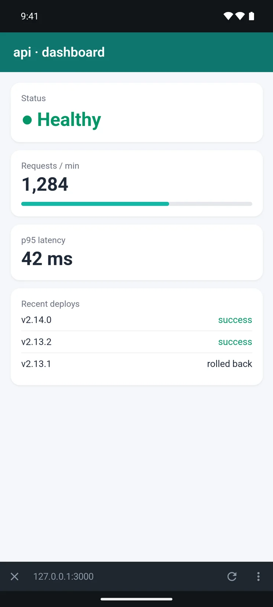

# lightmux

[简体中文](./README.md) | English

**The Android SSH client built for tmux. The whole app is 3.8 MB.**

SSH from a phone usually goes like this: connect → `tmux ls` → `tmux a -t xxx` → hunt for the window.

lightmux skips all of that: **open the app and the home screen already lists the tmux sessions and
windows on all your servers.** Tap one and you are in. Inside the terminal, swipe from the left edge
to jump to another session.

## Screenshots

<table>
  <tr>
    <td align="center" width="33%"><b>Home: host → session → window</b> </td>
    <td align="center" width="33%"><b>Terminal + quick bar</b> </td>
    <td align="center" width="33%"><b>Swipe to switch</b> </td>
  </tr>
  <tr>
    <td align="center" width="33%"><b>Host monitor</b> </td>
    <td align="center" width="33%"><b>Files</b> </td>
    <td align="center" width="33%"><b>Port forwarding + built-in browser</b> </td>
  </tr>
</table>

## Features

- **tmux, one tap away**: create, switch, rename and kill sessions and windows right from the
  home screen — no commands to type
- **Never lose your place**: stays connected in the background; when the network drops it reconnects
  on its own, back into the same session with your screen intact
- **A quick bar that fits your hands**: `Ctrl` `Esc` `Tab` and arrows, add / remove / drag to reorder,
  and turn a command or a combo like `Ctrl+B d` into a single button
- **Host monitor**: CPU, memory, disk, network, processes and containers at a glance
- **Files**: browse, upload, download, rename, delete — and edit small text files on the phone
- **Port forwarding**: bring a web service on the server (say port `3000`) to the phone and open it
  inside the app. When an address like `http://127.0.0.1:3000` shows up in the terminal, one tap opens it
- **Secure**: passwords and keys are encrypted with the system keystore; server fingerprints are
  remembered on first connect and a changed one is blocked; forwarded ports are reachable from this
  phone only
- **Also**: jump hosts (ProxyJump), shared key management, commands to run after login,
  light / dark themes, terminal color schemes, English and Chinese, in-app update check

Not planned: a local terminal (that is Termux's job), cloud sync and accounts, a desktop app.

## Download

Grab the latest APK from [CNB Releases](https://cnb.cool/ninvfeng/lighttools/lightmux/-/releases).
Requires Android 7.0 or later. It is not on any app store yet, so allow installing from an unknown
source once; after that, updates can be checked from inside the app.

## Privacy

No account, no ads, no analytics SDK. Apart from your own servers, the phone only talks to CNB once,
when you tap to check for updates.

## Contributing

Issues and PRs are welcome at [ninvfeng/lightmux](https://github.com/ninvfeng/lightmux) on GitHub.
Build instructions and conventions are in [CONTRIBUTING.md](./CONTRIBUTING.md) (Chinese);
security issues go through [SECURITY.md](./SECURITY.md). Release history: [CHANGELOG.md](./CHANGELOG.md).

## License

[MIT](./LICENSE). The terminal core comes from [Termux](https://github.com/termux/termux-app)
(Apache-2.0) — see [NOTICE](./NOTICE) and [THIRD_PARTY_NOTICES.md](./THIRD_PARTY_NOTICES.md).
