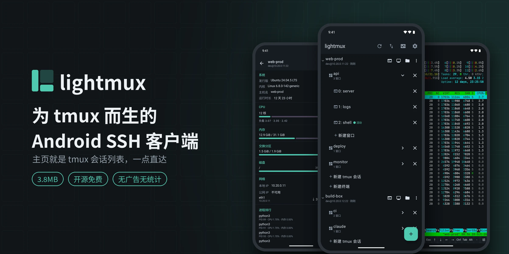
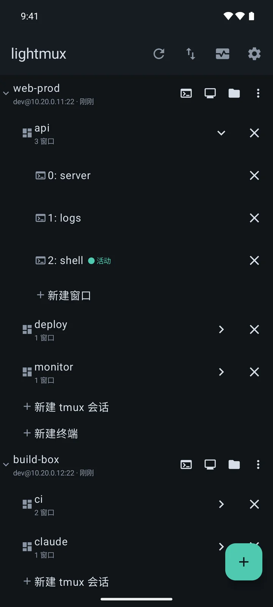
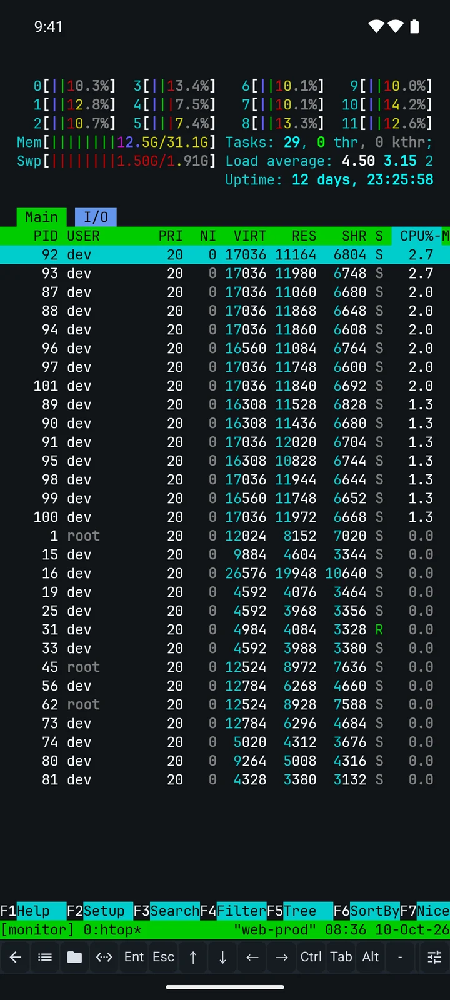
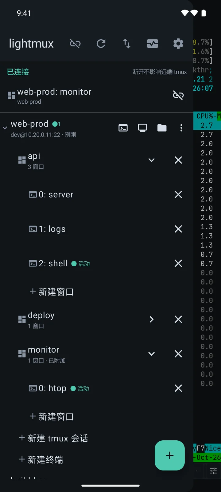
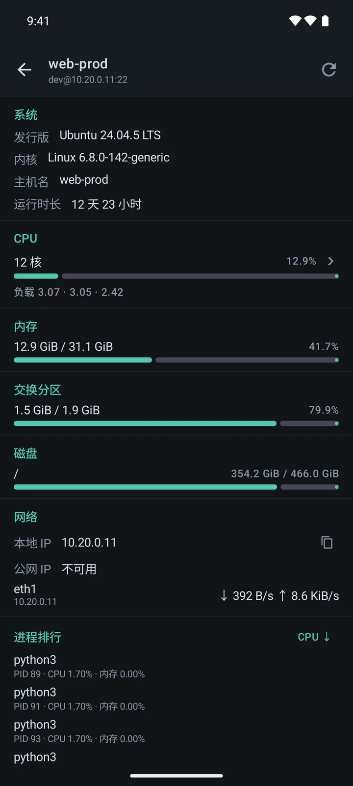
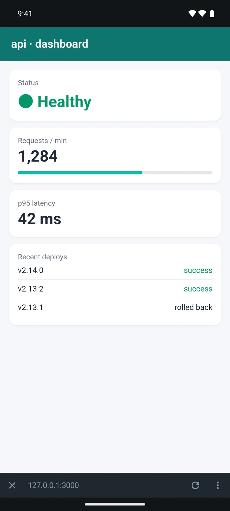

# lightmux

简体中文 | [English](./README.en.md)

**为 tmux 而生的 Android SSH 客户端。安装包只有 3.8MB。**

在手机上连服务器，你多半是这样：连上去 → `tmux ls` → `tmux a -t xxx` → 再找窗口。

lightmux 把这几步省了：**打开 app，主页就是你所有服务器上的 tmux 会话和窗口**，点一下直接进去。
在终端里从左边缘一划，就能切到另一个会话。

## 截图

| 主页：主机 → 会话 → 窗口 | 终端 + 快捷栏 | 侧滑切会话 |
|:---:|:---:|:---:|
|  |  |  |
| **主机监控** | **文件管理** | **端口转发 + 内置浏览** |
|  |  |  |

## 功能

- **tmux 会话一屏直达**：会话、窗口的新建 / 切换 / 重命名 / 结束都在主页完成，不用敲命令
- **断线不丢**：切到后台照样在线；网络断了自动重连，回来还在原来那个会话里，屏幕内容也都在
- **顺手的快捷栏**：`Ctrl` `Esc` `Tab` 方向键一应俱全，可以增删、拖动排序，
  还能把常用命令、`Ctrl+B d` 这类组合键做成一个按钮
- **主机监控**：CPU、内存、磁盘、网速、进程、容器，一眼看清哪台机器在忙什么
- **文件管理**：浏览、上传、下载、重命名、删除，小文本文件可以直接在手机上改
- **端口转发**：把服务器上的网页服务（比如 `3000` 端口）转到手机上，在 app 里直接打开；
  终端里一出现 `http://127.0.0.1:3000` 这样的地址，点一下就能看
- **安全**：密码和私钥用系统密钥库加密保存；首次连接记住服务器指纹，被调包会拦下来；
  转发出来的端口只有本机能访问
- **其他**：跳板机（ProxyJump）、密钥统一管理、登录后自动执行命令、
  深浅色主题、多套终端配色、中英双语、应用内检查更新

不做的：本地终端（那是 Termux 的事）、云同步与账号、桌面端。

## 下载

到 [CNB Releases](https://cnb.cool/ninvfeng/lighttools/lightmux/-/releases) 下载最新 APK，
需要 Android 7.0 及以上。目前没上应用商店，安装时允许一次「未知来源」即可，之后可在 app 内检查更新。

## 隐私

没有账号，没有广告，没有统计 SDK。手机这边除了连你自己的服务器，
只在你手动检查更新时访问一次 CNB。

## 参与

欢迎提 issue 和 PR，地址是 GitHub [ninvfeng/lightmux](https://github.com/ninvfeng/lightmux)。
构建方式与开发约定见 [CONTRIBUTING.md](./CONTRIBUTING.md)，安全问题请走 [SECURITY.md](./SECURITY.md)。
版本历史见 [CHANGELOG.md](./CHANGELOG.md)。

## 许可

[MIT](./LICENSE)。终端内核取自 [Termux](https://github.com/termux/termux-app)（Apache-2.0），
详见 [NOTICE](./NOTICE) 与 [THIRD_PARTY_NOTICES.md](./THIRD_PARTY_NOTICES.md)。
